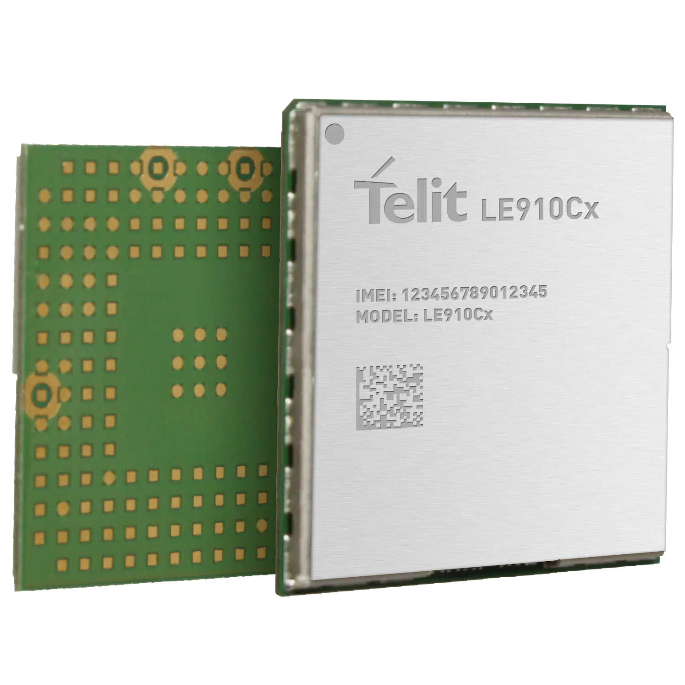

# Getting started guide for Telit Cinterion LE910C1-WWXD_AWS with AWS IoT ExpressLink 

# Document information

## Naming conventions

## Glossary
| Term       | Description                                       |
|------------|---------------------------------------------------|
| APN        | Access Point Name - used to define the LTE access |
| GPIO | General Purpose Input/Output |
| LGA | Large Grid Array |
| LTE | Long Term Evolution, cellular technology that bridges the 4G generation to the 5G | 
| SMD | Surface Mount Device | 
| VDC | Volts, Direct Current |

## Revision history

| Version | Date       | Notes       |
|---------|------------|-------------|
| 1.0     | 2023-04-19 | First issue |

# Overview

# Hardware Description

Telit Cinterion **LE910C1-WWXD_AWS** is the first Cat.1 module that qualifies for AWS IoT ExpressLink. 
Consisting of an industrial-grade module with LGA form factor for surface mount, it provides a wide range of peripherals to fit the needs of a variety of cellular IoT applications that work with AWS IoT. Main features of the module are:
1. LE910C1-WWXD_AWS LTE Cat.1 modem with pre-injected credentials and ExpressLink qualified firmware
1. LTE Antenna 
1. GPIOs 
1. dual SIM 
1. USB OTG 
1. 1.8 VDC power supply 
1. power management 

The following image represents the front and the rear of the LE910C1-WWXD_AWS. 

## Datasheet

You can find the LE910C1-WWXD_AWS product brief, Hardware / Software design guides, and more advanced documentation here: https://www.telit.com/le910cx-tx-download-zone/
Some of the guides and manuals require login access. Please register here https://dz.telit.com/register

When you fill up the form, if you do not have a Telit Cinterion Point of Contact, please specify **LE910C1 AWS IoT ExpressLink**

## AWS IoT ExpressLink signal Pinout 
Make note of the GPIOs exposed on the LE910C1-WWXD. Please note that GPIOs work in the range 0 - 1.8 VDC: if you need a level shifter you can drive the reference 1V8 with GPIO1. 

| PAD Symbolic signal |  Signal | I/O |
|--|--|--|
| GPIO 1  | Level shifter driver (optional) | Output |
| GPIO 2 | WAKE | Output |
| GPIO 3 | RESET | Output |
| GPIO 4 | EVENT | Input |
| MAIN UART RX C104/RXD | RX | Input |
| MAIN UART TX C103/TXD | TX | Output |

For further information please refer to the  [Hardware Design Guide](https://dz.telit.com/file/download/2312) section _Module Connections >>  Pin-out_

## Standard kit Contents

LE910C1-WWXD_AWS comes in tape or reel boxes and it is intended  for manufacturing or HW development. 
To get started with the product we recommend to purchase the appropriate development and evalution kit: 
1. here [Bravo Development Kit with AWS IoT ExpressLink](https://www.telit.com/support-tools/development-evaluation-kits/bravo-aws-expresslink/) 
2. or here [AWS device catalog page for Bravo Development Kit with AWS IoT ExpressLInk](https://devices.amazonaws.com/detail/a3G8W0000008011UAA/Bravo-LE910C1-WWXD-with-AWS-IoT-ExpressLink). It comes with a set of accessories to simplify the developer experience  and gets you started with AWS IoT ExpressLink in few minutes.

While you wait for the Bravo board to be delivered to your office or home, please start reading the [Bravo Development Kit with AWS IoT ExpressLink - Get started guide](get-started-guide-bravo-aws.md). 

# Develop a hardware+software IoT application with LE910C1-WWXD_AWS

## Rapid Prototyping and testing ideas
Once you familiarized with the development kit and evaluated the functionalities of the module, you may want to start prototyping your first project and validating the business idea.
It is highly recommended that you start prototyping with the Bravo Development Kit with AWS IoT ExpressLink, as it provides:
1. all you need to power up and connect your application: battery, usb, barrel power sources, embedded LTE antenna, external GNSS antenna
1. a range of high quality Bosch sensors that cover a wide range of scenarios and use cases
2. breadboard-like prototyping pins, allowing you to tinker with additional spare sensors, leds, buttons, or more complex pcbs
3. MikroBus socket, which allows you to host 1300+ expansion boards to further extend your prototype capabilities

With the Bravo board and AWS you will be able to start your first connection to AWS IoT in minutes, develop your first "Hello world" application in hours, and prototype your solution (HW box, SW on the box and on the cloud) in weeks. 

Thanks to the Bravo breadboarding capabilities, validating your concept with customers, investors and other relevant stakeholders will be easier, quicker and less expensive than adopting traditional, lenghty and less iterative development approach of PoC, EVT, DVT, etc.

## Build the first Mass production 
After your hardware and software components have been defined, along with the requirements in terms of power consumption, size, weight, lifetime, etc, it is time to build your first mass production batch.

If you have tested your idea with several prototypes and iterations, chances are you have a sufficiently well defined HW and SW design that allows you to satisfy the most compelling customer needs and make your product successful.

To achieve this, Telit Cinterion provides extensive documentation, including reference designs and application notes to help you develop the hardware with high quality standards. Please access the [Telit Cinterion Download Zone for LE910Cx products](https://www.telit.com/le910cx-tx-download-zone/) for general recommendation on how to integrate the module in your HW application and the [Telit Cinterion Download zone for Bravo Development kit](https://www.telit.com/bravo-evk-download-zone/) to get the reference designs for the current sensors, power supply components, embedded antenna design, etc.

## Design Validation
Telit Cinterion also provides [design validation services](https://www.telit.com/support-tools/) that help you avoid common -and less common- pitfalls in HW design, with particular reference to cellular IoT, in a variety of scenarios and applications.

